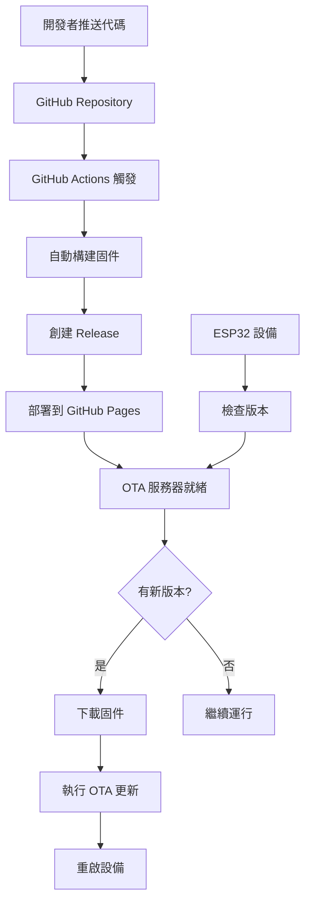

# ESP32 OTA 測試指南

## 概述

本文檔描述如何使用 GitHub 來測試 ESP32 離線地圖項目的 OTA (Over-The-Air) 更新功能。

## 系統架構



## 快速開始

### 1. 準備工作

確保你有以下環境：
- PlatformIO 已安裝
- Git 已配置
- ESP32 設備已連接 WiFi

### 2. 檢查 OTA 配置

運行檢查腳本：
```bash
./test_ota.sh check
```

### 3. 構建和測試

創建測試版本：
```bash
./test_ota.sh all v1.0.1
```

## 詳細步驟

### 步驟 1: 配置 GitHub Repository

1. **啟用 GitHub Actions**
   - 確保 `.github/workflows/` 目錄下的工作流文件已提交
   - 檢查 Repository 的 Actions 頁面

2. **啟用 GitHub Pages**
   - 進入 Repository Settings
   - 找到 Pages 設置
   - Source 設為 "Deploy from a branch"
   - Branch 選擇 "gh-pages"

### 步驟 2: 修改版本號

編輯 `src/main.cpp` 中的版本號：
```cpp
String currentVersion = "1.0.1"; // 更新這裡的版本號
```

### 步驟 3: 構建固件

運行構建命令：
```bash
# 只構建
./test_ota.sh build

# 或者完整的發布流程
./test_ota.sh release v1.0.1
```

### 步驟 4: 創建 GitHub Release

推送標籤觸發自動構建：
```bash
# 創建並推送標籤
./test_ota.sh tag v1.0.1

# 或者使用 git 命令
git tag -a v1.0.1 -m "Release version 1.0.1"
git push origin v1.0.1
```

### 步驟 5: 驗證 OTA 服務器

檢查以下 URL 是否可訪問：
- 版本檢查: `https://jiangalex.github.io/esp32-OffLineMap/version`
- 固件下載: `https://jiangalex.github.io/esp32-OffLineMap/firmware/firmware-png.bin`

### 步驟 6: 測試 OTA 更新

1. **上傳當前版本到設備**：
```bash
pio run -e esp32-s3-devkitc-1 -t upload
```

2. **配置 WiFi 連接**：
   修改 `src/main.cpp` 中的 WiFi 設置：
```cpp
WiFi.begin("your_ssid", "your_password");
```

3. **監控串行輸出**：
```bash
pio device monitor
```

4. **觀察 OTA 日誌**：
   設備應該顯示類似以下的日誌：
```
OTA Updater initialized - Current version: 1.0.0
Performing initial OTA check on boot...
Remote version response: {"version":"1.0.1"}
Current: 1.0.0, Remote: 1.0.1
New version available!
Starting OTA update. Firmware size: 1234567 bytes
...
OTA update completed successfully!
Rebooting device in 3 seconds...
```

## 本地測試

如果要在本地測試 OTA 服務器：

1. **啟動本地服務器**：
```bash
./test_ota.sh server
```

2. **修改測試 URL**：
   暫時修改 `platformio.ini` 中的 URL：
```ini
-D OTA_SERVER_URL=\"http://192.168.1.100:8000/firmware-png.bin\"
-D OTA_VERSION_URL=\"http://192.168.1.100:8000/version.json\"
```

3. **重新編譯和上傳**：
```bash
pio run -e esp32-s3-devkitc-1 -t upload
```

## 故障排除

### 常見問題

1. **WiFi 連接失敗**
   - 檢查 SSID 和密碼
   - 確保設備在 WiFi 範圍內

2. **HTTP 請求失敗**
   - 檢查服務器 URL 是否正確
   - 驗證網絡連接
   - 檢查防火牆設置

3. **OTA 更新失敗**
   - 檢查固件大小是否超過可用空間
   - 驗證固件文件完整性
   - 確保 HTTPS 證書有效

4. **版本比較錯誤**
   - 確保版本格式一致
   - 檢查 JSON 響應格式

### 調試技巧

1. **啟用詳細日誌**：
   在 `platformio.ini` 中添加：
```ini
-DCORE_DEBUG_LEVEL=3
```

2. **手動測試 API**：
```bash
# 測試版本檢查
curl -v https://jiangalex.github.io/esp32-OffLineMap/version

# 測試固件下載
curl -I https://jiangalex.github.io/esp32-OffLineMap/firmware/firmware-png.bin
```

3. **監控網絡流量**：
   使用 Wireshark 或其他工具監控 ESP32 的網絡請求

## 安全注意事項

1. **HTTPS 使用**
   - GitHub Pages 提供免費 HTTPS
   - 避免使用不安全的 HTTP 連接

2. **版本驗證**
   - 考慮添加數字簽名驗證
   - 實現回滾機制

3. **訪問控制**
   - 可以考慮使用私有倉庫
   - 添加 API 密鑰驗證

## 進階配置

### 自定義 OTA 服務器

如果需要更複雜的 OTA 服務器功能，可以：

1. 使用 Express.js 或其他 Web 框架
2. 添加設備認證
3. 實現增量更新
4. 添加更新統計和監控

### 多環境支持

項目支持兩種構建環境：
- `esp32-s3-devkitc-1`: PNG 格式地圖
- `esp32-s3-devkitc-1-bin`: BIN 格式地圖

可以根據需要選擇相應的固件進行更新。

## 參考資料

- [ESP32 OTA 官方文檔](https://docs.espressif.com/projects/esp-idf/en/latest/esp32/api-reference/system/ota.html)
- [Arduino OTA 庫](https://github.com/esp8266/Arduino/tree/master/libraries/ArduinoOTA)
- [GitHub Actions 文檔](https://docs.github.com/en/actions)
- [PlatformIO 文檔](https://docs.platformio.org/)