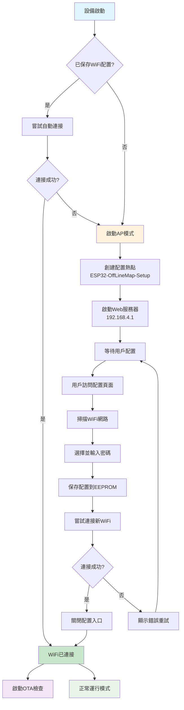
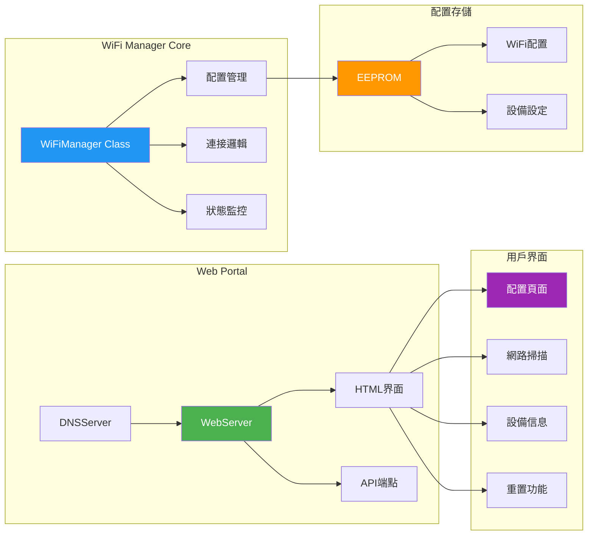
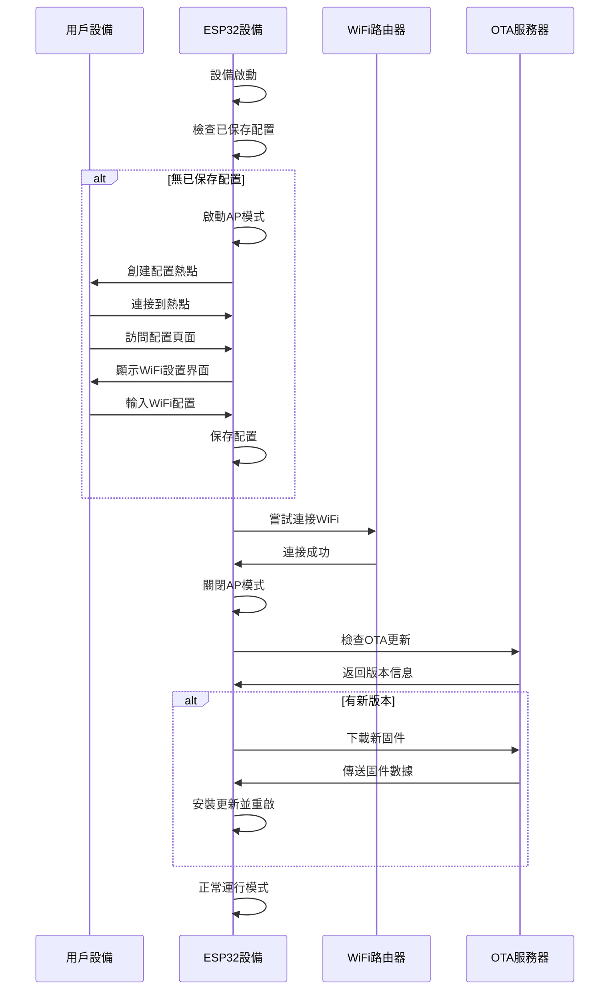

# ESP32 離線地圖 - WiFi Manager 架構圖

```mermaid
graph TB
    A[設備啟動] --> B{已保存WiFi配置?}
    B -->|是| C[嘗試自動連接]
    B -->|否| D[啟動AP模式]
    
    C --> E{連接成功?}
    E -->|是| F[WiFi已連接]
    E -->|否| D
    
    D --> G[創建配置熱點<br/>ESP32-OffLineMap-Setup]
    G --> H[啟動Web服務器<br/>192.168.4.1]
    H --> I[等待用戶配置]
    
    I --> J[用戶訪問配置頁面]
    J --> K[掃描WiFi網路]
    K --> L[選擇並輸入密碼]
    L --> M[保存配置到EEPROM]
    M --> N[嘗試連接新WiFi]
    
    N --> O{連接成功?}
    O -->|是| P[關閉配置入口]
    O -->|否| Q[顯示錯誤重試]
    
    P --> F
    Q --> I
    
    F --> R[啟動OTA檢查]
    F --> S[正常運行模式]
    
    style A fill:#e1f5fe
    style F fill:#c8e6c9
    style D fill:#fff3e0
    style R fill:#f3e5f5
    style S fill:#e8f5e8
```

## WiFi Manager 功能架構

```mermaid
graph LR
    subgraph "WiFi Manager Core"
        A[WiFiManager Class]
        B[配置管理]
        C[連接邏輯]
        D[狀態監控]
    end
    
    subgraph "Web Portal"
        E[WebServer]
        F[DNSServer]
        G[HTML界面]
        H[API端點]
    end
    
    subgraph "配置存儲"
        I[EEPROM]
        J[WiFi配置]
        K[設備設定]
    end
    
    subgraph "用戶界面"
        L[配置頁面]
        M[網路掃描]
        N[設備信息]
        O[重置功能]
    end
    
    A --> B
    A --> C
    A --> D
    
    E --> G
    E --> H
    F --> E
    
    B --> I
    I --> J
    I --> K
    
    G --> L
    G --> M
    G --> N
    G --> O
    
    style A fill:#2196f3,color:#fff
    style E fill:#4caf50,color:#fff
    style I fill:#ff9800,color:#fff
    style L fill:#9c27b0,color:#fff
```

## 整合流程圖

```mermaid
sequenceDiagram
    participant User as 用戶設備
    participant ESP32 as ESP32設備
    participant WiFi as WiFi路由器
    participant Server as OTA服務器
    
    ESP32->>ESP32: 設備啟動
    ESP32->>ESP32: 檢查已保存配置
    
    alt 無已保存配置
        ESP32->>ESP32: 啟動AP模式
        ESP32->>User: 創建配置熱點
        User->>ESP32: 連接到熱點
        User->>ESP32: 訪問配置頁面
        ESP32->>User: 顯示WiFi設置界面
        User->>ESP32: 輸入WiFi配置
        ESP32->>ESP32: 保存配置
    end
    
    ESP32->>WiFi: 嘗試連接WiFi
    WiFi->>ESP32: 連接成功
    ESP32->>ESP32: 關閉AP模式
    
    ESP32->>Server: 檢查OTA更新
    Server->>ESP32: 返回版本信息
    
    alt 有新版本
        ESP32->>Server: 下載新固件
        Server->>ESP32: 傳送固件數據
        ESP32->>ESP32: 安裝更新並重啟
    end
    
    ESP32->>ESP32: 正常運行模式
```